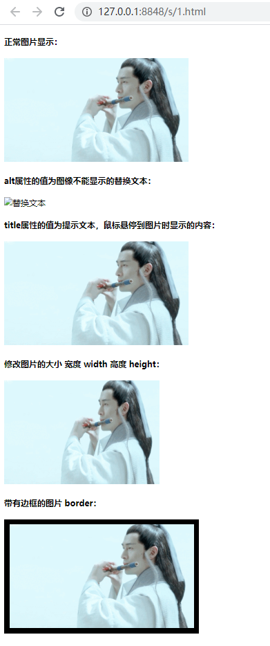

## 标签属性

在介绍图片标签之前，先来说一下标签的属性，所谓属性就是外在特性，可以参考手机来理解 HTML 的属性，**比如：**一部手机，手机的颜色是什么颜色的、手机的尺寸大小之类的。

使用 HTML 制作网页时，如果想让 HTML 标签提供更多的信息，可以使用HTML标签的属性加以设置。

**语法：**

```html
<标签名 属性1="属性值1" 属性2="属性值2" …> 内容 </标签名>
<手机 颜色="红色" 大小="5寸"> 内容 </手机>
```

**说明：**

- 标签可以拥有多个属性，必须写在开始标签中，位于标签名后面。
- 属性之间不分先后顺序，标签名与属性、属性与属性之间均以空格分开。
- 采取  键值对 的格式  key="value"  的格式。
- 属性和属性值对大小写不敏感，但推荐使用小写。

## 图片标签 img

`` 为单标签，是单词 `image` 的缩写，如果想要在网页中显示图像就需要使用该标签。

**语法：**

在该语法中 `src` 属性用于指定图像文件的路径和文件名，它是 `` 标签的必需属性。

```html

```

### 图片标签的属性

| 属性       | 属性值                         | 描述                           |
| ---------- | ------------------------------ | ------------------------------ |
| src        | URL                            | 图像的路径                     |
| alt        | 文本                           | 图像不能显示时的替换文本       |
| title      | 文本                           | 提示文本，鼠标悬停时显示的内容 |
| width      | 像素（XHTML不支持%页面百分比） | 设置图像的宽度                 |
| hight      | 像素（XHTML不支持%页面百分比） | 设置图像的高度                 |
| ~~border~~ | ~~数字~~                       | ~~设置图像边框的宽度~~         |

**说明：**`border` 后面我们会用css来做，这里只需要记住这个 `border` 单词就好了。

**示例：**

```html
<!DOCTYPE html>                       
<html>
	<head>                            
		<meta charset="utf-8">
		<title>认识图像标签</title>
	</head>
	<body>
		<h4>正常图片显示：</h4>
		
		<h4>alt属性的值为图像不能显示的替换文本：</h4>
		
		<h4>title属性的值为提示文本，鼠标悬停到图片时显示的内容：</h4>
		
		<h4>修改图片的大小 宽度 width 高度 height：</h4>
		
		<h4>带有边框的图片 border：</h4>
		
	</body>
</html>
```

**在浏览器中显示的效果如下：**

