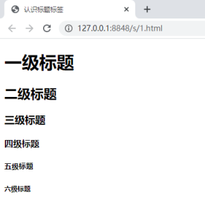
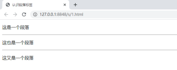

排版标签主要是和css搭配使用，显示网页结构的标签，是网页布局最常用的标签。

## 标题标签 h

`<hx>` 标签为双标签，`<head>` 单词的缩写，用来表示标题，为了使网页更具有语义化，我们经常会在页面中使用标题标签。

HTML提供了6个等级的标题，分别是 h1、h2、h3、h4、h5、h6，这6个表示不同级别的标题，`<h1>` 定义最大的标题，`<h6>` 定义最小的标题，并且依据重要性递减。

**语法：**

```html
<h1>这是一个标题</h1>
```

**示例：**

```html
<!DOCTYPE html>                       
<html>
  <head>                            
    <meta charset="utf-8">
    <title>认识标题标签</title>
  </head>
  <body>
    <h1>一级标题</h1>
    <h2>二级标题</h2>
    <h3>三级标题</h3>
    <h4>四级标题</h4>
    <h5>五级标题</h5>
    <h6>六级标题</h6>
  </body>
</html>
```

**在浏览器中显示的效果如下：**



**小结：**

- 加了标题的文字会变的加粗，字号也会变大。
- 一行只能放一个标题，标题独占一行。

## 段落标签 p

`<p>` 标签为双标签，`paragraph` 单词的缩写，可以把 HTML 文档分割成若干段落，多个段落要用多个 `<p>` 标签表示。

**语法：**

```html
<p>这是一个段落</p>
```

**示例：**

```html
<!DOCTYPE html>                       
<html>
	<head>                            
		<meta charset="utf-8">
		<title>认识段落标签</title>
	</head>
	<body>
		<p>这是一个段落</p>
		<p>这也是一个段落</p>
		<p>这又是一个段落</p>
	</body>
</html>
```

**在浏览器中显示的效果如下：**


**说明：**默认情况下，文本在一个段落中会根据浏览器窗口的大小自动换行。

## 水平线标签 hr

`<hr>` 标签为单标签，`horizontal` 单词的缩写，是用来创建横跨网页水平线的标签。

在网页中常常看到一些水平线将段落与段落之间隔开，使得文档结构清晰，层次分明。

这些水平线可以通过插入图片实现，也可以简单地通过标签来完成。

**语法：**

```html
<hr>    这是一个水平线
```

**示例：**

```html
<!DOCTYPE html>                       
<html>
	<head>                            
		<meta charset="utf-8">
		<title>认识段落标签</title>
	</head>
	<body>
		<p>这是一个段落</p>
		<hr>
		<p>这也是一个段落</p>
		<hr>
		<p>这又是一个段落</p>
	</body>
</html>
```

**在浏览器中显示的效果如下：**



## 课堂练习：简单的新闻界面

利用上面所学的知识，写出一个简单的新闻界面。

**在浏览器中显示的效果如下：**


## 换行标签 br

`<br>` 标签为单标签，是单词 `break` 的缩写，用来表示换行。

在 HTML 中，一个段落中的文字会从左到右依次排列，直到浏览器窗口的右端，然后自动换行。

如果希望某段文本强制换行显示，就需要使用换行标签，因为浏览器是不能识别你在源代码中使用的换行，敲回车键换行是不起作用的。

**语法：**

```html
<br>	这是一个换行
```

**示例：**

```html
<!DOCTYPE html>                       
<html>
    <head>                            
        <meta charset="utf-8">
        <title>认识换行标签</title>
    </head>
    <body>
        路漫漫其修远兮，<br>
        吾将上下而求索。
    </body>
</html>
```

**在浏览器中显示的效果如下：**


## div 和 span 标签

`<div>` 和 `<span>` 标签都为双标签，它们是没有任何语义的，主要就是当一个盒子来装内容的。

`<div>` 是单词 `division` 的缩写，为分割、分区的意思，即表示可定义文档中的分区或节，其实有很多 `<div>` 来组合网页。

`<span>` 为跨度，跨距，范围的意思，被用来组合文档中的行内元素。

**语法：**

```html
<div>这是头部</div>
<span>被用来组合文档中的行内元素</span>
```

**示例：**

```html
<!DOCTYPE html>                       
<html>
    <head>                            
        <meta charset="utf-8">
        <title>认识div和span标签</title>
    </head>
    <body>
        <div>路漫漫其修远兮，</div>
        <div>吾将上下而求索。</div>
        <span>少年易老学难成，</span>
        <span>一寸光阴不可轻。</span>
    </body>
</html>
```

**在浏览器中显示的效果如下：**


**说明：**

它们两个都是盒子，用来装我们网页元素的。

只不过他们有区别，现在我们主要记住使用方法和特点就可以了，后面用到时会有详细的介绍。

- `<div>` 标签  用来布局的，但是现在一行只能放一个 `<div>` 。
- `<span>` 标签  用来布局的，一行上可以放好多个 `<span>` 。

## 排版标签总结


