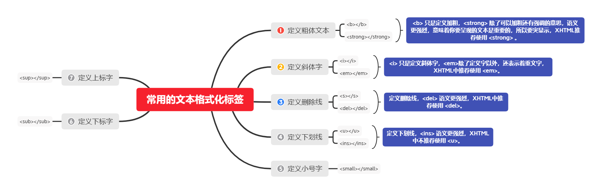
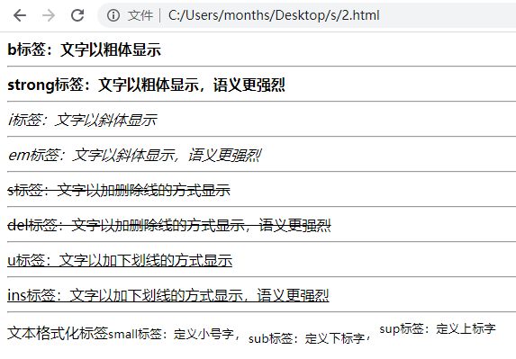

在网页中，有时需要为文字设置粗体、斜体或下划线效果，这时就需要用到HTML中的文本格式化标签，使文字以特殊的方式显示。

## 常用的 HTML 文本格式化标签



## 说明

- `<b>` 标签只是定义加粗，`<strong>` 标签除了可以加粗还有强调的意思，语义更强烈，意味着你要呈现的文本是重要的，所以要突出显示。
- 剩下的同理...

## 示例

```html
<!DOCTYPE html>                       
<html>
  <head>                            
    <meta charset="utf-8">
    <title>认识文本格式化标签</title>
  </head>
  <body>
    <b>b标签：文字以粗体显示</b>
    <hr>
    <strong>strong标签：文字以粗体显示，语义更强烈</strong>
    <hr>
    <i>i标签：文字以斜体显示</i>
    <hr>
    <em>em标签：文字以斜体显示，语义更强烈</em>
    <hr>
    <s>s标签：文字以加删除线的方式显示</s>
    <hr>
    <del>del标签：文字以加删除线的方式显示，语义更强烈</del>
    <hr>
    <u>u标签：文字以加下划线的方式显示</u>
    <hr>
    <ins>ins标签：文字以加下划线的方式显示，语义更强烈</ins>
    <hr>
    文本格式化标签<small>small标签：定义小号字</small>，<sub>sub标签：定义下标字</sub>，<sup>sup标签：定义上标字</sup>
  </body>
</html>
```

**在浏览器中显示的效果如下：**

