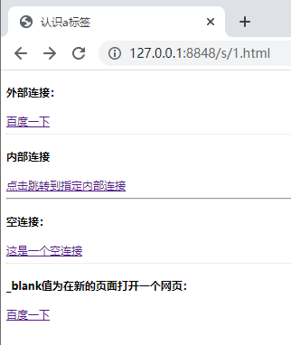
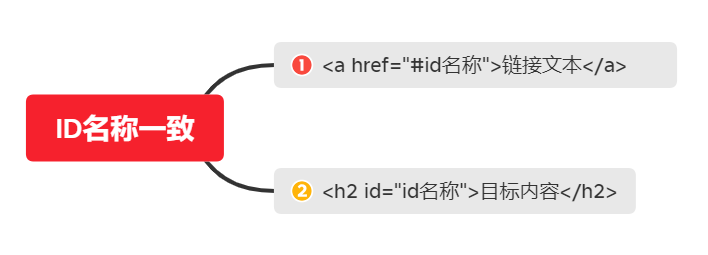
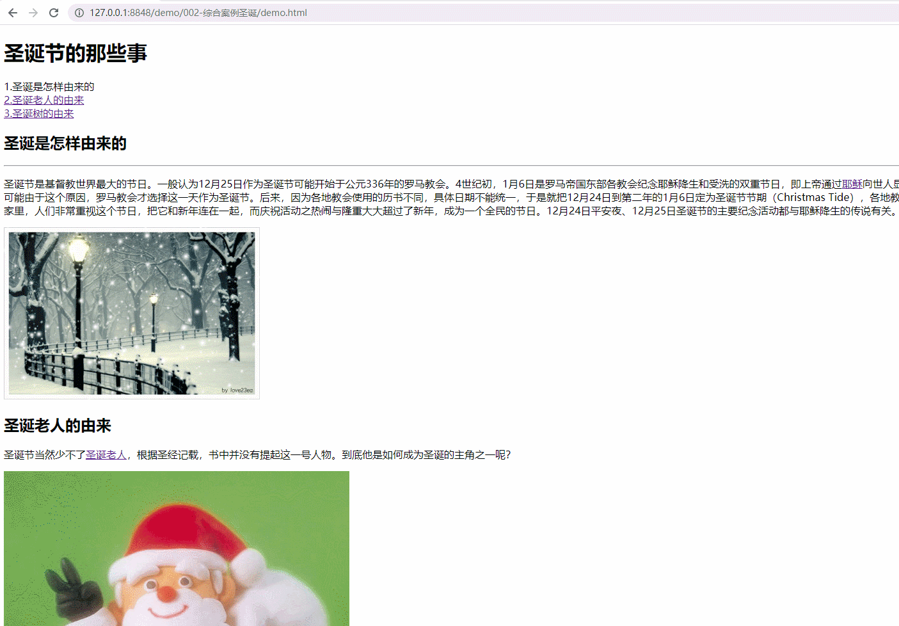
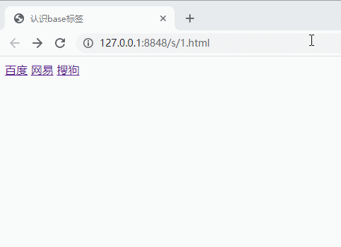
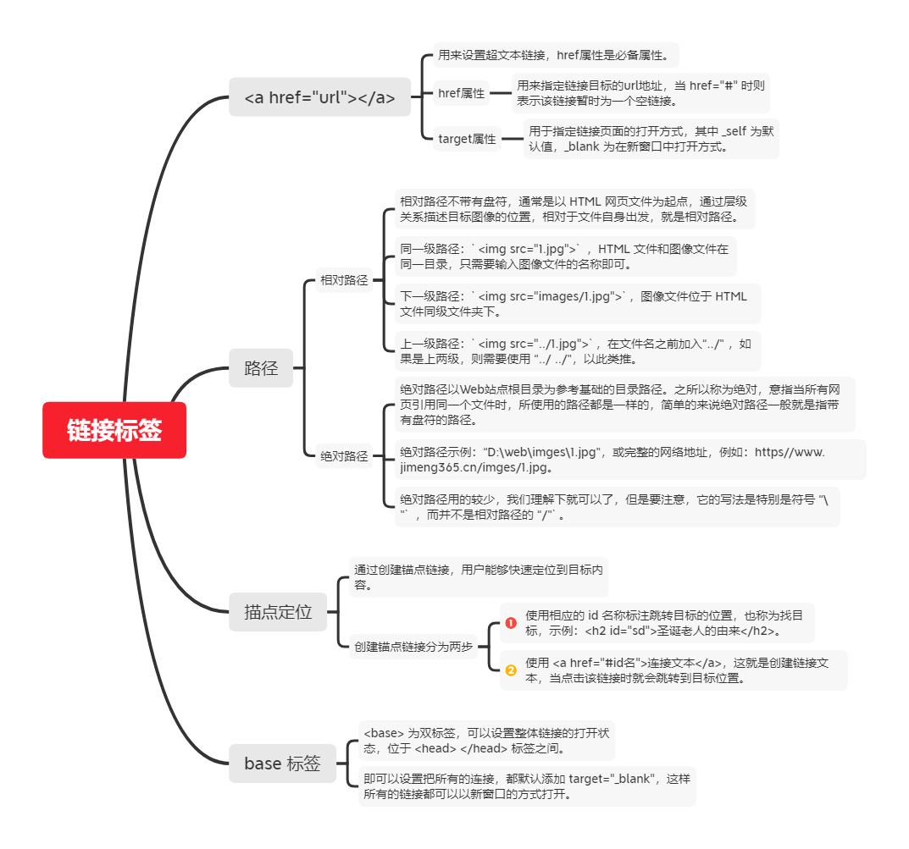

HTML 使用 `<a>` 标签来设置超文本链接，`<a>` 标签为双标签，是单词 `anchor` 的缩写。 

超链接可以是一个字，一个词，或者一组词，也可以是一幅图像，你可以点击这些内容来跳转到新的文档或者当前文档中的某个部分。

**语法：**

```html
<a href="url">链接文本</a>
```

**属性：**

| 属性   | 属性值                            | 描述                                                         |
| ------ | --------------------------------- | ------------------------------------------------------------ |
| href   | URL地址                           | 用来指定链接目标的url地址，必备属性，当为标签具备 href 属性时，它就具有了超链接的功能。 |
| target | 其取值有 `_self` 和 `_blank` 两种 | 用于指定链接页面的打开方式，其中 `_self` 为默认值，`_blank` 为在新窗口中打开方式。 |

**示例：**

```html
<!DOCTYPE html>                       
<html>
	<head>                            
		<meta charset="utf-8">
		<title>认识a标签</title>
	</head>
	<body>
		<h4>外部连接：</h4>
		<a href="https://www.baidu.com">百度一下</a>
		<hr>
		<h4>内部连接</h4>
		<a href="index.html">点击跳转到指定内部连接</a>
		<hr>
		<h4>空连接：</h4>
		<a href="#">这是一个空连接</a>
		<hr>
		<h4>_blank值为在新的页面打开一个网页：</h4>
		<a href="https://www.baidu.com" target="_blank">百度一下</a>
	</body>
</html>
```

**在浏览器中显示的效果如下：**



**说明：**

- 外部链接，网址前方需要添加 http:// 。
- 内部链接，直接链接内部页面名称即可，比如 `< a href="index.html">` 首页 `</a >`。
- 如果当时没有确定链接目标时，通常将链接标签的href属性值定义为 `“#”` ，即 `href="#"` ，表示该链接暂时为一个空链接。
- 不仅可以创建文本超链接，在网页中各种网页元素，如图像、表格、音频、视频等都可以添加超链接。

## 路径

比如在插入图片时就需要采用 “路径” 的方式来指定图像文件的位置，路径可以分为： 相对路径和绝对路径。

### 相对路径

相对路径不带有盘符，通常是以 HTML 网页文件为起点，通过层级关系描述目标图像的位置，相对于文件自身出发，就是相对路径。

**说明：**

- 同一级路径：`` ，HTML 文件和图像文件在同一目录，只需要输入图像文件的名称即可。
- 下一级路径：``，图像文件位于 HTML 文件同级文件夹下。
- 上一级路径：``，在文件名之前加入“../” ，如果是上两级，则需要使用 “../ ../”，以此类推。

### 绝对路径

绝对路径以Web站点根目录为参考基础的目录路径。之所以称为绝对，意指当所有网页引用同一个文件时，所使用的路径都是一样的，简单的来说绝对路径一般就是指带有盘符的路径。

**说明：**

- 绝对路径示例：“D:\web\imges\1.jpg”，或完整的网络地址，例如：`https//www.jimeng365.cn/imges/1.jpg`。
- 绝对路径用的较少，我们理解下就可以了，但是要注意，它的写法是特别是符号 `“\”` ，而并不是相对路径的`“/”`。

## 锚点定位

通过创建锚点链接，用户能够快速定位到目标内容。

**创建锚点链接分为两步：**

- 使用相应的 id 名称标注跳转目标的位置，也称为找目标，示例：`<h2 id="sd">圣诞老人的由来</h2>`。
- 使用 `<a href="#id名">连接文本</a>`，这就是创建链接文本，当点击该链接时就会跳转到目标位置。



**示例：**

```html
<a href="#sd">2.圣诞老人的由来 </a>
.....
<h2 id="sd">圣诞老人的由来</h2>
```

**在浏览器中显示的效果如下：**



## base 标签

`<base>` 为双标签，可以设置整体链接的打开状态，位于 `<head> </head>` 标签之间。

即可以设置把所有的连接，都默认添加 `target="_blank"`，这样所有的链接都可以以新窗口的方式打开。

**示例：**

```html
<!DOCTYPE html>                       
<html>
	<head>                            
		<meta charset="utf-8">
		<title>认识base标签</title>
		<base target="_blank" />
	</head>
	<body>
		<a href="https://www.baidu.com">百度</a>
		<a href="https://www.163.com">网易</a>
		<a href="https://www.sogou.com/">搜狗</a>
	</body>
```

**在浏览器中显示的效果如下：**



## 总结



