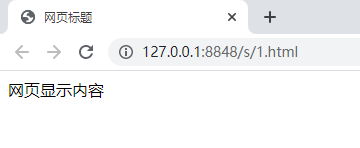
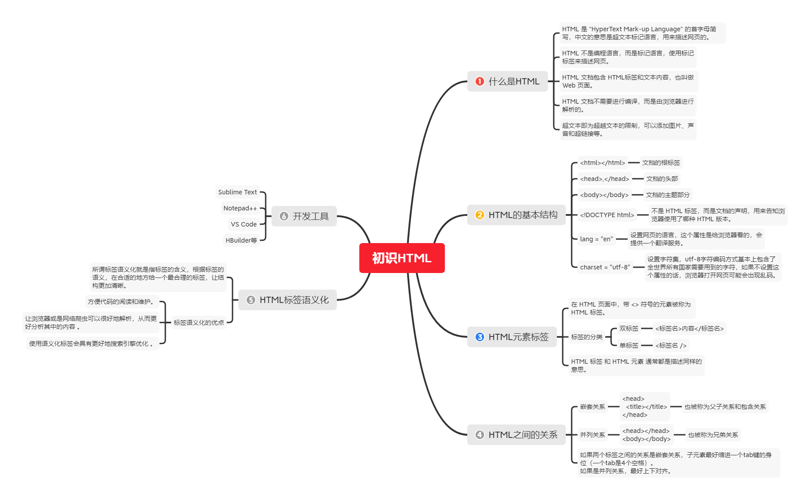

## 什么是 HTML

HTML是 “HyperText Mark-up Language” 的首字母简写，中文意思是超文本标记语言，是一种用来描述网页的语言。

- HTML 不是编程语言，而是一种标记语言，它有一套标记标签。
- HTML 是使用标记标签来描述网页的。
- HTML 文档包含了 HTML 标签及文本内容，HTML 文档也叫做 Web 页面。
- HTML 文档不需要进行编译，是直接由浏览器进行解析的，浏览器会按照标签描述的内容将 HTML 文档渲染成网页，不会直接显示标签。

## 超文本的含义

超越文本限制，可以添加图片、声音、动画、多媒体等内容，还可以从一个文件跳转到另一个文件，与世界各地主机的文件链接。

## HTML 的基本结构

```html
<!DOCTYPE html>                       
<html lang="en">
  <head>                            
    <meta charset="utf-8">
    <title>网页标题</title>
  </head>
  <body>
    网页显示内容
  </body>
</html>
```

**在浏览器中显示的效果如下：**



### html 标签

- `<html>` 标签为双标签，是文档的根标签，除了文档声明标签外，其它所有的标签都需要写在根标签中才可以显示在网页上。
- `<html>` 标签位于 HTML 文档的最前面，用来标识HTML文档的开始。
- `</html>` 标签位于HTML文档的最后面，用来标识 HTML 文档的结束，中间的部分是文档的头部和主体。

### head 标签

- `<head>` 标签为双标签，是文档的头部，之间的文本描述文档的元（meta）数据、脚本、样式、以及其它更多的信息，**如：**`<meta charset="utf-8">` 即为定义网页编码格式为UTF-8。
- 绝大多数文档头部包含的数据都不会真正作为内容显示给读者，但是浏览器会在标题栏显示 `<title>` 中的内容，因为 ` <title> 与 </title>`  之间的文本是用来描述HTML文档的标题。

### body 标签

- `<body>` 标签为双标签，是文档的主题部分，之间的文本是可见的页面内容，比如文本、超链接、图像、表格和列表等等。
- `<body>` 标签出现在 `</head>` 标签之后，且必须在闭标签 `</html>` 之前闭合。

### !DOCTYPE html

- `<!DOCTYPE html>` 不是一个 HTML 标签，而是声明的意思，用来告知 Web 浏览器 页面使用了哪种 HTML 版本，如：HTML5、HTML4、XHTML，`<!DOCTYPE html>` 表示这是一个 HTML5 文档。
- `<!DOCTYPE html>` 声明必须位于文档中的最前面的位置，处于 <html> 标签之前，而且是不区分大小写的。

### lang="en"

- lang是language的缩写，表示设置网页的语言，取值若为 `en`，则定义语言为英文，`zh-CN` 则定义语言为中文，`fr` 是法语网站等等。
- 这里不管设置中文还是英文，网页都可以正常显示中英文。
- 这个参数只是给浏览器看的，比如网页设置成 `en`，Google会提示你是否翻译成中文；如果设置成 `zh-CN`，Google就不会提示翻译服务了。

### charset="utf-8"

- 设置字符集，计算机要准确的处理各种字符集文字，需要进行字符编码，以便计算机能够识别和存储各种文字。
- 若不设置 `charset` 属性的话，浏览器或者手动打开文件可能会出现乱码的情况。

### 编码扩展

utf-8是目前最常用的字符集编码方式，常用的字符集编码方式还有gbk和gb2312。

- gb2312 简单中文  包括6763个汉字。
- BIG5   繁体中文 港澳台等用。
- GBK包含全部中文字符，   是GB2312的扩展，加入对繁体字的支持，兼容GB2312。
- UTF-8则基本包含全世界所有国家需要用到的字符。

## HTML 元素标签

在 HTML 页面中，带 `"<>"` 符号的元素被称为 HTML 标签，如上面提到的 `<html>、<head>、<body>` 等都是 HTML 标签。

### 标签的分类

标签分为双标签和单标签，也被称为常规元素和空元素。

#### 双标签

```html
<标签名>内容</标签名>	比如：<body>我是主体部分</body>
```

- 标签一般都是成对出现的，有**开始标签和结束标签**，结束标签比开始标签多了一个关闭符 "/" 。
- 开始和结束标签也被称为开放标签和闭合标签。

#### 单标签

```html
<标签名 />		比如：<br />
```

- 单标签简单的说就是里面不需要包含内容，只有一个开始标签。
  关闭单标签的正确方法是在开始标签中添加 / 即可，也可以不进行关闭。
  虽然单标签可以不进行关闭，但为了获取更长远的保障，建议关闭。

#### 说明

- HTML 标签 和 HTML 元素 通常都是描述同样的意思。
- 严格的来说，一个 HTML元素 包含着开始标签和结束标签，**以开始标签起始，以结束标签终止，元素的内容是开始标签与结束标签之间的内容**，而HTML 文档是由嵌套的 HTML 元素构成。

## HTML 之间的关系

针对 双标签 的相互关系分为两种，分别是 嵌套关系 和 并列关系。

### 嵌套关系

用父子关系来理解，如下：`<head>` 里面包含着 `<title>` 标签，这种关系也可以叫做包含关系。

```html
<head>
  <title></title>
</head>
```

### 并列关系

并列关系可以用兄弟关系来理解。

```html
<head></head>
<body></body>
```

### 说明

- 如果两个标签之间的关系是嵌套关系，子元素最好缩进一个tab键的身位（一个tab是4个空格）。
- 如果是并列关系，最好上下对齐。

## HTML 标签语义化

所谓标签语义化就是指标签的含义，根据标签的语义，在合适的地方给一个最合理的标签，让结构更加清晰。

### 标签语义化的优点

- 方便代码的阅读和维护。
- 同时让浏览器或是网络爬虫可以很好地解析，从而更好分析其中的内容 。
- 使用语义化标签会具有更好地搜索引擎优化 。

**语义是否良好：** 当我们去掉CSS之后，网页结构依然组织有序，并且有良好的可读性。(  裸奔起来一样好看 )

**遵循的原则：**先确定语义的HTML ，再选合适的CSS。所以，接下来学习html标签，要根据语义去记忆。 HTML网页中任何元素的实现都要依靠HTML标签。

## 开发工具

俗话说：工欲善其事，必先利其器，所以选择一款好的开发工具，能让我们开发的过程中事半功倍。

**开发工具有：**记事本、sublime text、notepad++、Dreamweaver、vscod、HBuilder等等。

- Sublime Text：http://www.sublimetext.com/
- Notepad++：https://notepad-plus-plus.org/
- VS Code：https://code.visualstudio.com/
- HBuilder：https://www.dcloud.io/

### 说明

- 虽然可以使用记事本开发，但是为了提高我们的开发效率和减少代码的出错，我们不提倡用记事本进行开发，另外在实际开发的过程中基本上没有人使用记事本。
- 另外Windows创建的文本文件默认编码格式是GBK的，所以如果在文本文档上写代码时，需要将当前文档的编码设置为GBK，否则会出现乱码。

## 总结

