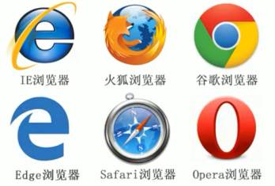
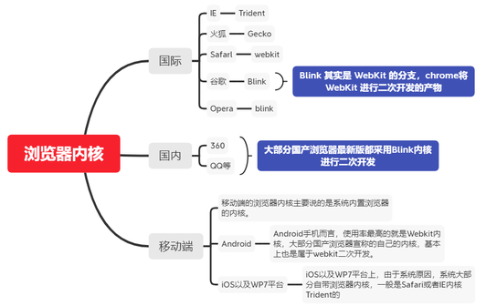
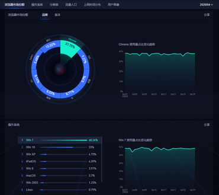
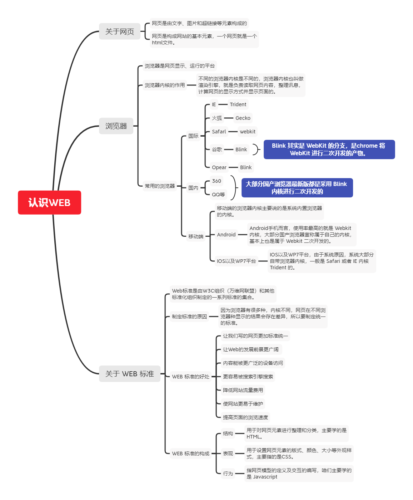

## 认识网页

网页是由文字、图片和超链接等元素构成的，当然，除了这些元素，网页中还可以包含音频、视频以及Flash等。

网页是构成网站的基本元素，一个网页就是一个html文件。

## 浏览器

浏览器是网页显示、运行的平台，常用的浏览器有IE、火狐、谷歌、Safari、Edge和Opera等，其中谷歌浏览器在世界上占的份额最大。

国内也有一些比较出名的浏览器，如：360极速浏览器、QQ浏览器等。

不同的浏览器内核是不同的，浏览器内核也叫做渲染引擎，就是负责读取网页内容，整理讯息，计算网页的显示方式并显示页面的。

通过 https://tongji.baidu.com/research/site?source=index 这个网址可以查看浏览器当前占有的市场份额，目前谷歌浏览器市场占有率最高。

## 关于 WEB 标准

Web标准是由W3C组织（万维网联盟）和其他标准化组织制定的一系列标准的集合。

### 制定标准的原因

因为浏览器有很多种，内核也不一样，所以我们写的网页在不同的浏览器中显示的结果可能存在一点差异，所以要制定一些统一的标准。

### WEB 标准的好处

遵循web标准可以让不同我们写的页面更标准更统一外，还有许多优点，如：
1. 让Web的发展前景更广阔  
2. 内容能被更广泛的设备访问
3. 更容易被搜寻引擎搜索
4. 降低网站流量费用
5. 使网站更易于维护
6. 提高页面浏览速度

### WEB 标准的构成

主要是由结构（Structure）、表现（Presentation）和行为（Behavior）三个方面构成的。

- **结构：**用于对网页元素进行整理和分类，主要学的是HTML。
- **表现：**用于设置网页元素的版式、颜色、大小等外观样式，主要指的是CSS。
- **行为：**指网页模型的定义及交互的编写，咱们主要学的是 Javascript

### WEB 标准小结

1. Web标准有三层结构，分别是结构（html）、表现（css）和行为（javascript）。
2. 结构类似人的身体， 表现类似人的着装， 行为类似人的行为动作
3. 理想状态下，它们三层都是独立的， 先后分别放到不同的文件里面（htnl文件、css文件、js文件），然后在html文件中调用即可达到网页的最终效果（前期我们会将一些css样式直接在html里面写）。

## 总结

